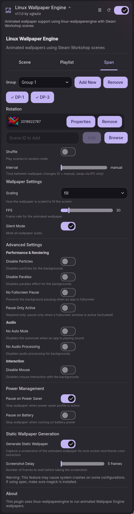

# DMS-WallpaperEngine

A DankMaterialShell plugin for [linux-wallpaperengine](https://github.com/Almamu/linux-wallpaperengine).



## Installation

### Pre-requisites
1. Install [linux-wallpaperengine](https://github.com/Almamu/linux-wallpaperengine).

### From Plugin Registry (Recommended)
1. Open DMS Settings
2. Go to Plugins tab
3. Click Browse
4. Click "Show 3rd Party Plugins" and confirm.
5. Search for Linux Wallpaper Engine

### Manual Installation
```bash
# Copy plugin to DMS plugins directory (create it if it doesn't exist)
cp -r LinuxWallpaperEngine ~/.config/DankMaterialShell/plugins/

# Enable in DMS settings under Plugins tab.
```

## Features

### The active tab is the global config type
The settings page has three tabs, and the tab you're on is the **one global config type that renders** — the others are fully ignored (but stay saved):
- **Scene** — only per-monitor static scenes render (one per monitor; `*` is the default for unconfigured monitors).
- **Playlist** — only per-monitor playlists render (rotating scenes, with shuffle/interval).
- **Span** — only span groups render (one wallpaper stretched across multiple monitors, with its own scene or rotation + shuffle/interval).

So if you have a scene configured and switch to the Span tab, the scene stops rendering and only span groups render — switch back to Scene and it returns. Nothing is erased; the tab just selects which type is active. The active tab is remembered, so reopening settings highlights the same tab. (To run a single scene under the Span tab, make a 1-monitor span group.)

The **Scene** tab shows a large preview of the current scene. The **Playlist** and **Span** tabs show a table of the rotation's scenes (thumbnail + scene id + Properties + Remove), with Browse and an add-by-ID field below.

### Settings are per-output
Each monitor, `*`, and span group keeps its own scaling, FPS, volume, silent, screenshot delay, and advanced toggles — a 1440p monitor and a spanned pair showing the same scene can have different scaling or FPS. The one exception is **Configure Scene Properties** (`--set-property`), which stays per-scene since those values are intrinsic to the wallpaper's content.

**Playlist interval can be set to 0** for manual/IPC-only scene swapping (the rotation only advances when you call `dms ipc call linuxWallpaperEngine next|prev|random`).

### All Monitors default (`*`)
The Monitor dropdown includes an **All Monitors (`*`)** option. A config set on `*` acts as the default for every monitor that does NOT have its own config explicitly set. Monitors with their own config take precedence over `*`.

When `*` is in playlist mode, all monitors inheriting it show the **same** wallpaper and rotate in sync (no independent shuffle), and audio plays from only one instance to avoid echo.

### Span groups (`--screen-span`)
The **Span** tab lets you stretch a single wallpaper across multiple monitors (e.g. a 5120x1440 wallpaper across two 2560x1440 panels). Use the Groups dropdown to add/select a group, toggle its monitors, and pick a scene or rotation.

The plugin launches one `linux-wallpaperengine` process with `--screen-span m1,m2,... --bg <id>`; the engine uses `xdg-output` for correct per-monitor positioning. Render settings are per span group (see above).

Requires a `linux-wallpaperengine` build that includes the `--screen-span` feature (upstream PR #557, merged).

### Power management
**Pause on Power Saver** / **Pause on Battery** freeze wallpapers when the system is on power-saver or unplugged, rather than killing them. The running processes are suspended in place (`SIGSTOP`), so the last rendered frame stays on screen like a paused video while using no CPU. When the condition clears, they're resumed (`SIGCONT`) — no relaunch or flicker. Any scene/monitor changes made while paused are applied on resume.

### IPC commands & keyboard shortcuts
Plugin on/off is built into DMS for every plugin:
```bash
dms ipc call plugins toggle linuxWallpaperEngine
```

Scene rotation is exposed by this plugin under the `linuxWallpaperEngine` IPC target:
```bash
dms ipc call linuxWallpaperEngine next [monitor]            # next in playlist (all playlists if no monitor)
dms ipc call linuxWallpaperEngine prev [monitor]            # previous
dms ipc call linuxWallpaperEngine random [monitor]          # random scene
dms ipc call linuxWallpaperEngine set <sceneId> [monitor]   # set a specific scene (default: main monitor; "*" allowed). Arg order is flexible: `set <monitor> <sceneId>` also works.
dms ipc call linuxWallpaperEngine list                      # show active wallpaper per monitor/group
```

The optional `monitor` arg targets one output; if it belongs to a span group or inherits `*`, the right owner is resolved automatically. Omitting it advances every active playlist at once.

DMS does not define shortcuts itself. Bind these in your window manager config:

**Hyprland** (`~/.config/hypr/hyprland.conf`):
```ini
bind = SUPER, W, exec, dms ipc call plugins toggle linuxWallpaperEngine
bind = SUPER, N, exec, dms ipc call linuxWallpaperEngine next
bind = SUPER SHIFT, N, exec, dms ipc call linuxWallpaperEngine prev
```

**Niri** (`~/.config/niri/config.kdl`):
```kdl
Mod+W { spawn "sh" "-c" "dms ipc call plugins toggle linuxWallpaperEngine"; }
Mod+N { spawn "sh" "-c" "dms ipc call linuxWallpaperEngine next"; }
```

## Troubleshooting
- Span groups need a `linux-wallpaperengine` build with `--screen-span` support; check `linux-wallpaperengine --help`.
- `--screen-span` requires Wayland `xdg-output-unstable-v1` support in the compositor for correct positioning.
- Static wallpaper generation writes one screenshot per output. For span groups, the live `--screen-span` process captures a single wide image, which the plugin crops per monitor (`<monitor>-<sceneId>.jpg`, ordered by screen position, sized to each monitor's native resolution) using ImageMagick (`magick`). Requires `magick`/ImageMagick to be installed for span crops; without it, the whole wide image is applied to each monitor instead.
